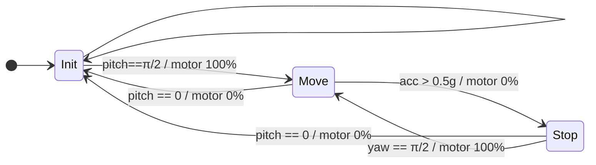

# FSM 


To make our lives easier, I suggest we use Mermaid.js to outline the FSM for the subscription logic. Once we're satisfied with the design, I'll create a more visually appealing diagram in [Draw.io](http://draw.io/).


For this initial version of our state machine, we have three states:


**Init** – This is the boot state where the submarine is ready to begin movement. All setup procedures are run before arriving at this state. We initialize the gyroscope by holding the sub upright, with its nose pointing towards the sky.


**Move** – By tilting the sub 90 degrees (a pitch change of 90 degrees) such that the sub lays flat, we transition from the init state to the move state.


**Stop** – If the accelerometer registers acceleration greater than a certain threshold, this indicates that we have collided with the end of the tank, and the motor should be turned off. However, if we manually turn the sub and detect that it has rotated more than 90 degrees in the yaw direction (Z-axis), we then restart the motor.


From either state, we can return to the init state if the sub is picked up and placed in an upright position again.





# Notion to Markdown integration 


This script automatically syncs content from Notion to Markdown files in this repository.


### **Setup & Run**

1. **Compile TypeScript:**

	```text
	shCopy code
	tsc notion_to_md.ts
	```

2. **Install Dependencies:**

	```text
	shCopy code
	npm install
	```

3. **Execute Sync:**

	```text
	shCopy code
	node notion_to_md.js
	```


Run the above command whenever you need to sync Notion content to Markdown.


### **Automation**


Set up a cron job or similar scheduler to automate the sync process. Here's an example for hourly syncs:


```text
cronCopy code
0 * * * * node /path/to/notion_to_md.js
```


_Ensure your Notion API keys are correctly configured before running the script._

