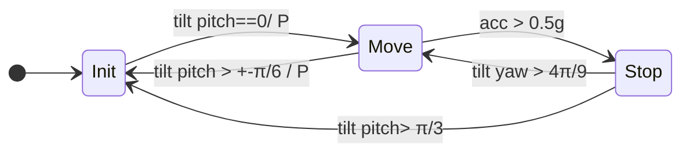

# FSM 


To make our lives easier, I suggest we use Mermaid.js to outline the FSM for the subscription logic. Once we're satisfied with the design, I'll create a more visually appealing diagram in [Draw.io](http://draw.io/).





# Notion to Markdown integration 


This script automatically syncs content from Notion to Markdown files in this repository.


### **Setup & Run**

1. **Compile TypeScript:**

	```text
	shCopy code
	tsc notion_to_md.ts
	```

2. **Install Dependencies:**

	```text
	shCopy code
	npm install
	```

3. **Execute Sync:**

	```text
	shCopy code
	node notion_to_md.js
	```


Run the above command whenever you need to sync Notion content to Markdown.


### **Automation**


Set up a cron job or similar scheduler to automate the sync process. Here's an example for hourly syncs:


```text
cronCopy code
0 * * * * node /path/to/notion_to_md.js
```


_Ensure your Notion API keys are correctly configured before running the script._

